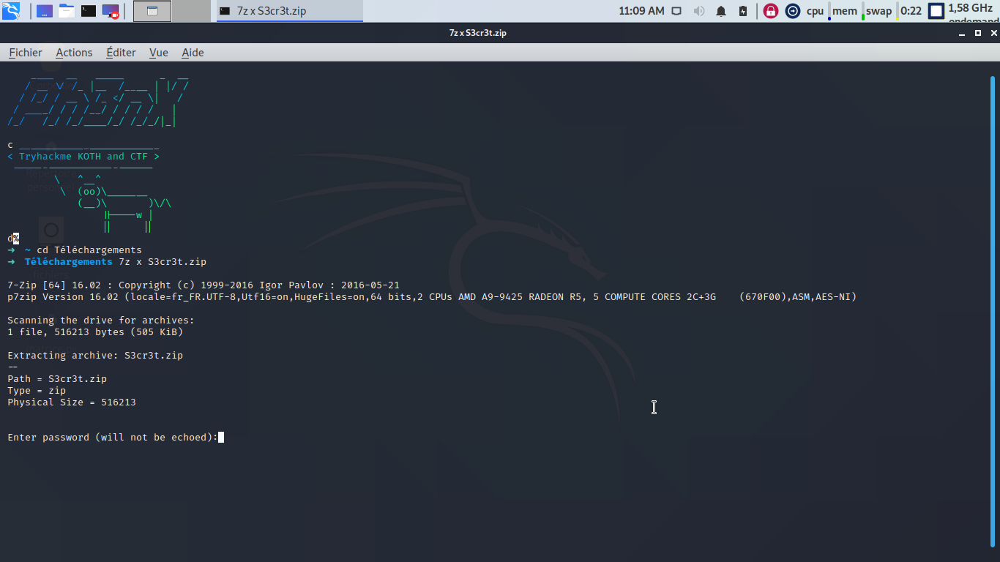
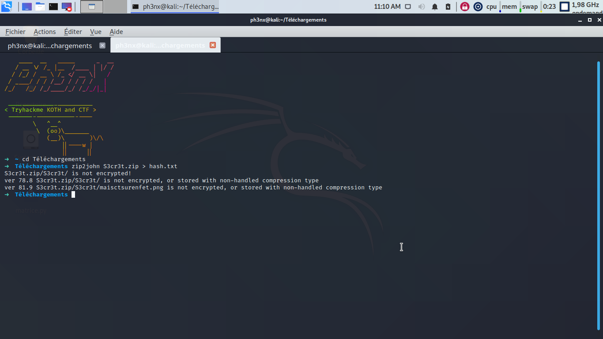
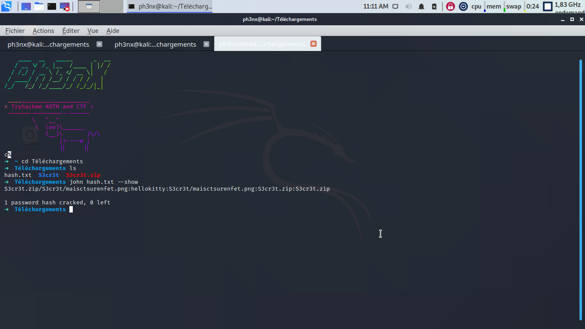
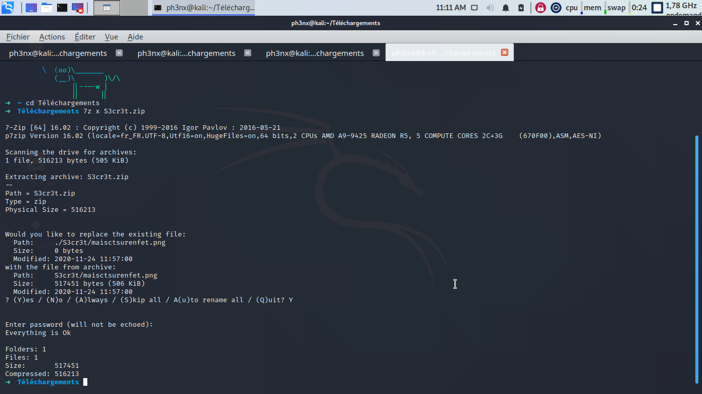
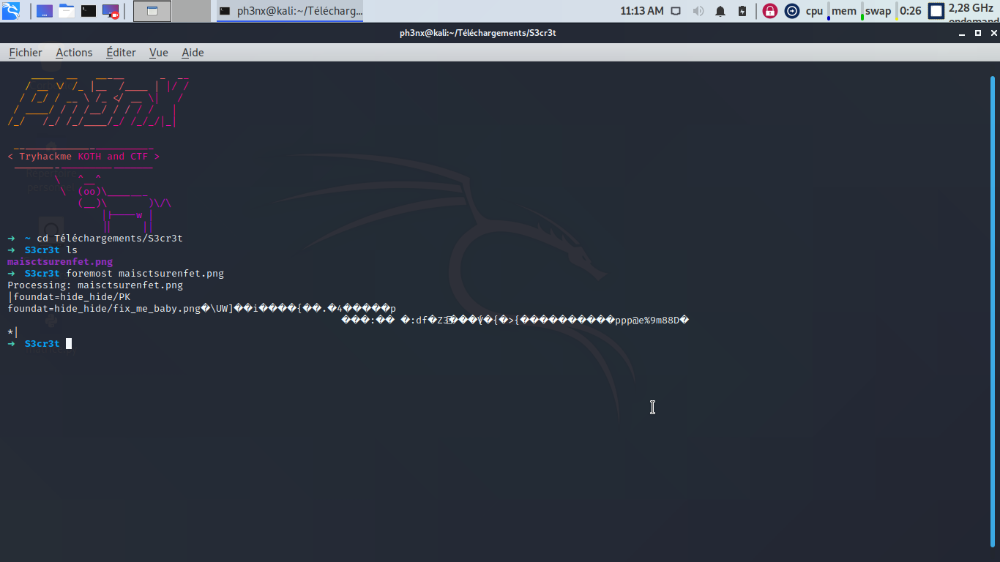
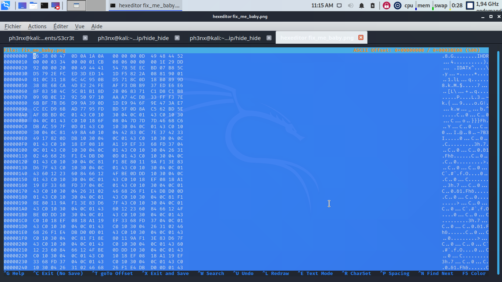
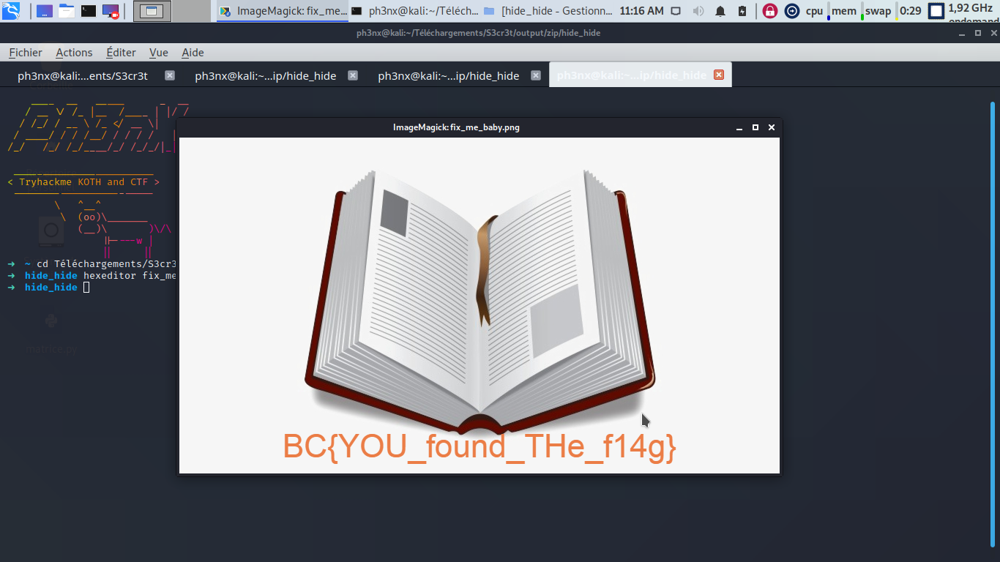

# BookCTF - Secret Book

----------------------------------------------------------------------

## Introduction

Salut, Secret Book est le nom du 5ème ctf de la partie MISC du concour BOOKCTF.
Je vais te montrer comment je l'ai resolu :)

----------------------------------------------------------------------

## Sommaire

|Partie| Lien |Difficulté|
|------|------|----------|
|Zip Cracking| [Zip Cracking](https://github.com/Ph3nX-Z/Writeups/tree/main/BookCTF%20-%20Hidden%20Path#zip-cracking) | Easy |
|Steganography| [Steganography](https://github.com/Ph3nX-Z/Writeups/tree/main/BookCTF%20-%20Hidden%20Path#steganography) | Medium |
|Recovery | [Recovery](https://github.com/Ph3nX-Z/Writeups/tree/main/BookCTF%20-%20Hidden%20Path#recovery) | Medium |

----------------------------------------------------------------------

## Resolution

### Zip Cracking

La premiere chose qu'on remarque en téléchargeant le fichier, est qu'il est sous format zip.
J'essaye d'abord de le decompresser a l'aide de unzip, mais le chiffrement du zip n'est pas supporté par celui ci. Je me suis donc tourné vers 7zip qui est, selon moi, le plus complet des logiciels de decompression.
Apres avoir essayé de decompresser le fichier, on constate qu'il y a un mot de passe. Ce n'est pas tellement etonnant puisqu'un chiffrement etait appliqué aux fichier...

----------------------------------------------------------------------



----------------------------------------------------------------------

On va donc essayer de cracker le mot de passe de notre fichier .zip. Pour cela on genere d'abords le hash du fichier grace a zip2john

----------------------------------------------------------------------



----------------------------------------------------------------------

Apres avoir fait le hash du fichier il va falloir faire correspondre celui ci avec un des mots de la wordlist. On utilise de nouveau john pour trouver le mot de passe :
```sh
john hash.txt --show
```

----------------------------------------------------------------------



----------------------------------------------------------------------

Le mot de passe que nous sort john est le bon !

On peut enfin decompresser notre zip !

----------------------------------------------------------------------



----------------------------------------------------------------------

### Steganography

Apres avoir decompressé le fichier on tombe sur un fichier .png. La premiere chose a laquelle je pense quand j'arrive devant une image est la stegano. J'execute donc foremost sur le fichier:
```sh
foremost fichier.png
```
Mon intuition etait bonne, il y avait un fichier caché dans l'image !

----------------------------------------------------------------------



----------------------------------------------------------------------

### Recovery

Je decompresse maintenant le fichier zip dans lequel sont les fichiers extraits de l'image.
On tombe sur un fichier qui s'appelle : fix_me_baby.png, ce qui nous met sur la bonne piste, puisqu'il va falloir reparer le header du .png.
pour reparer le header on va utiliser un editeur d'hexadecimal (dans notre cas hexeditor):
```sh
hexeditor fichier.png
```

----------------------------------------------------------------------



----------------------------------------------------------------------

Effectivement le header du png est corrompu puisque le header est normalement :
```sh
89 50 4e 47 0d 0a 1a 0a
```
On va alors changer le header du fichier pour le bon !

----------------------------------------------------------------------


----------------------------------------------------------------------

Apres avoir changé le header j'ouvre l'image, et je tombe sur le flag !

----------------------------------------------------------------------



----------------------------------------------------------------------


## Merci d'avoir lu ce writeup et A+


