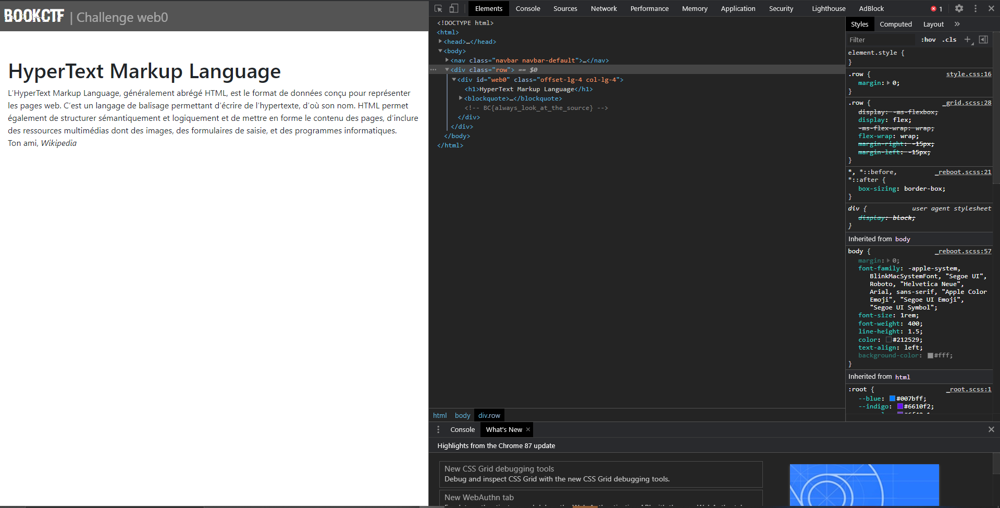
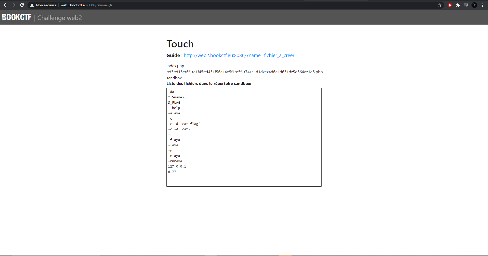
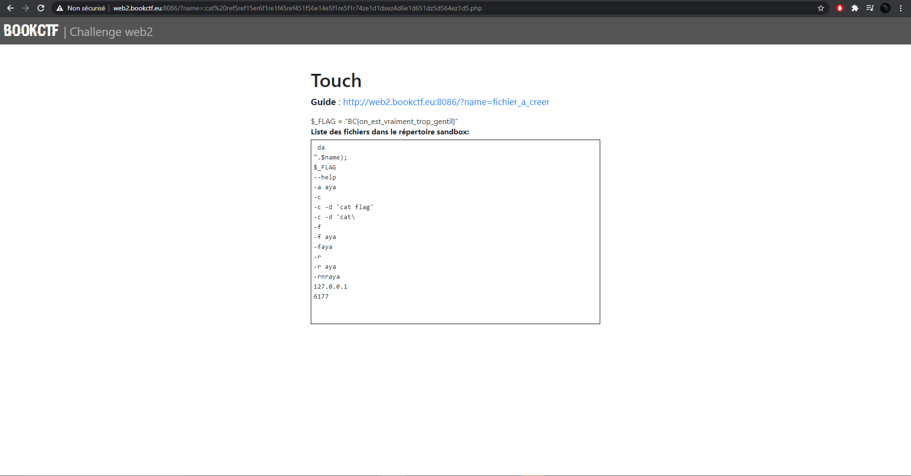
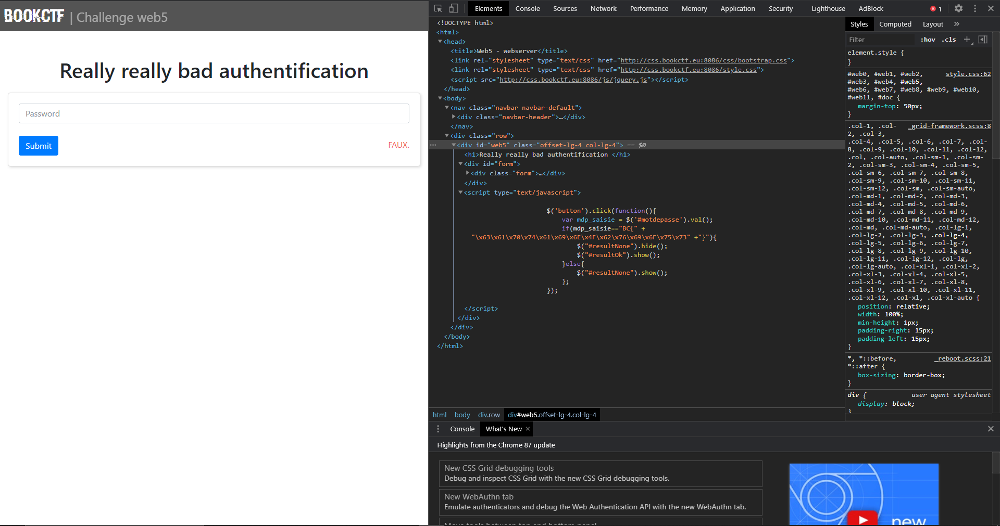
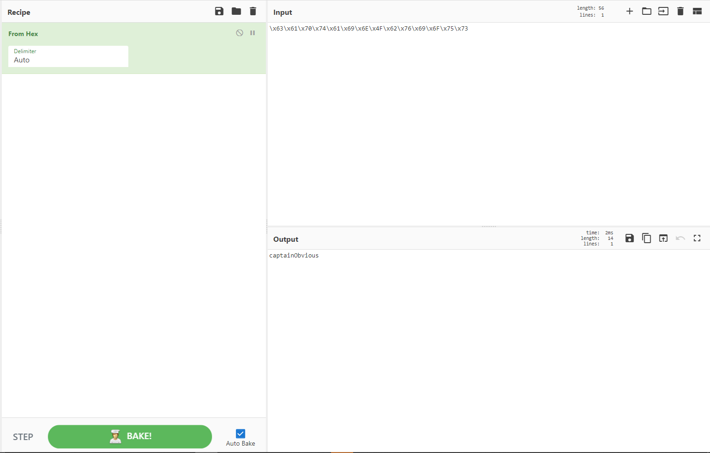
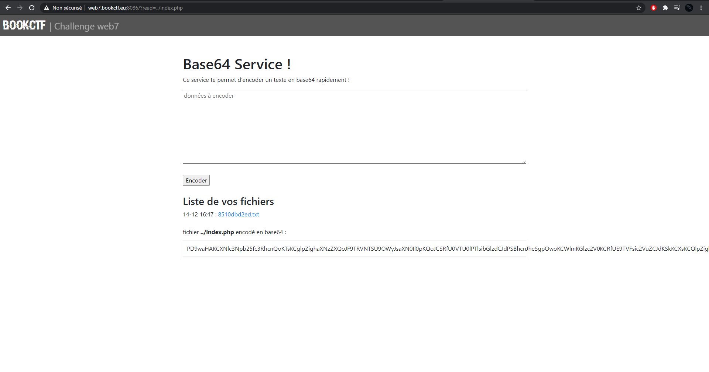
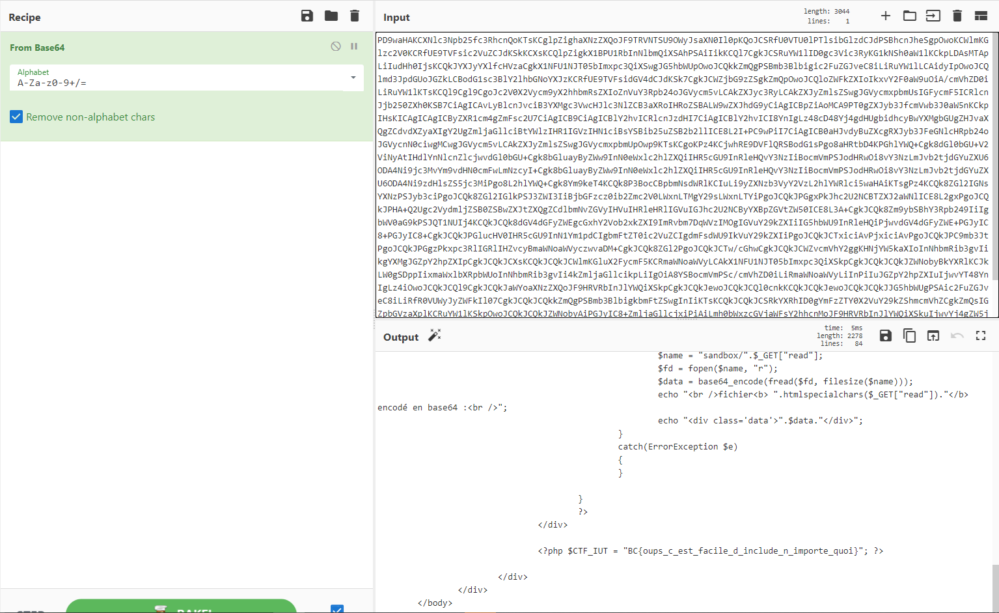
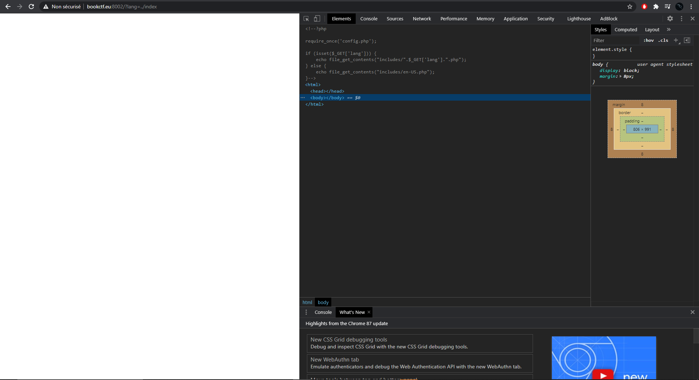
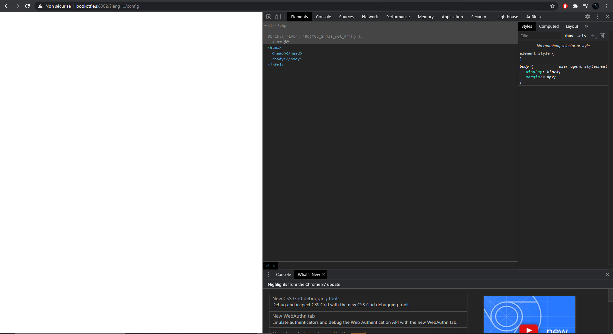

# CTFs Web

---------------------------------------------------------------
---------------------------------------------------------------

## Introduction

Ce writeup est un condensé de plusieurs CTFs web provenants du challenge BOOKCTF.

Bonne Lecture :)

---------------------------------------------------------------

## Web0

Il fallait juste regarder le code source de la page index !



---------------------------------------------------------------
---------------------------------------------------------------

## Web1

On regarde d'abord le code source. On voit qu'il y a un parametre conseillé dans le code source (is_admin), on sait que sa valeur est un booleen puisque c'est soit oui soit non (1-0/True-False)
On renseigne donc le parametre avec 1:
```sh
?is_admin=1
```


---------------------------------------------------------------
---------------------------------------------------------------

## Web2

Lorsqu'on arrive sur le ctf, ce qu'on voit en premier est "Touch". Touch est le nom d'un outil sous linux qui permet de creer des fichiers. Grace au code php quon a sous la mains, on peut egalement constater que l'url peut prendre un argument name. Sous linux pour faire deux commandes a la suite on peut utiliser un ";". On renseigne donc name avec ls pour voir tous les fichiers qui sont dans le repertoir:
```sh
?name=;ls
```



Nous pouvons voir qu'il y a un fichier dont le nom est plutot long, j'ai donc copié le nom du fichier et utilisé "cat" en argument.
```sh
?name=;cat <fichier>.php
```



Et voila le flag !

---------------------------------------------------------------
---------------------------------------------------------------

## Web5

Le web5 s'intitule "bad authentification", on peut se douter avec ce nom que le script qui sert a l'authentification est visible. Quand on regarde le code source du site on tombe sur une balise script qui sert a integrer du code dans le html.

Lorsque l'on regarde ce code, on se rend compte que le flag y est, mais sous forme d'hexadecimal.



J'essaye alors de passer la chaine hex a une chaine en ascii.



Et voila le contenu du flag !

---------------------------------------------------------------
---------------------------------------------------------------

## Web7

Dans le CTF web7 on peut voir qu'un fichier est mis en argument (avec la variable read), j'essaye donc de mettre en argument index.php. Et il se trouve que le programme me lis bien index.php et me l'encode en base64:
```sh
read=../index.php
```



Je vais ensuite decoder la chaine trouvée pour avoir le code de la page php en clair:



Et voila le flag !

---------------------------------------------------------------
---------------------------------------------------------------

## Hellfy

Hellfy repose sur une faille connue qui s'appelle la lfi. On pouvait se douter que cette faille allait etre presente au vue du nom du challenge. Le principe d'une lfi (local file inclusion) va etre d'injecter un fichier dans l'url afin d'y avoir acces. J'essaye d'abord avec index.php:
```sh
?lang=../index.php
```



On tombe sur une page blanche, mais ne nous decourageons pas, on check le code de notre page blanche et on constate qu'il y a bien le code de index.php mis en commentaire dans la page.
Lorsqu'on lis le code de index.php on remarque qu'une autre page est evoquée : config.php. J'essaye donc d'afficher le contenu du fichier config.php avec notre lfi:
```sh
?lang=../config.php
```



Et encore une fois le code de config.php est en commentaire (caché). Et si on regarde bien le code, on peut voir notre flag !

---------------------------------------------------------------
---------------------------------------------------------------

# Merci D'avoir lu ce writeup
