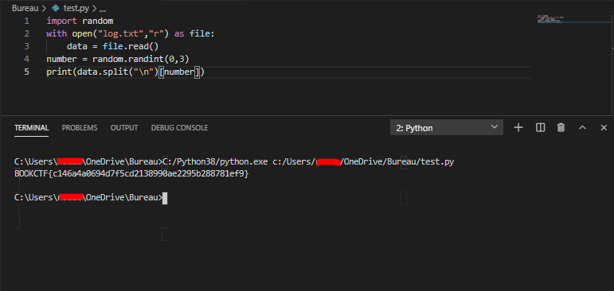

# BookCTF - Without Me 
----------------------------------------------------------------------------------------------------------
## Introduction
__Salut tout le monde,
"Without Me" est le nom du 3ème CTF de la partie MISC. 
Je vais te montrer comment j'ai resolu ce CTF :)__

----------------------------------------------------------------------------------------------------------

## Sommaire

|Partie| Lien |Difficulté|
|------|------|----------|
|Preparation| [Preparation](https://github.com/Ph3nX-Z/Writeups/blob/main/BookCTF%20-%20Without%20Me/README.md#preparations) | Easy |
|Exploitation| [Exploiration](https://github.com/Ph3nX-Z/Writeups/blob/main/BookCTF%20-%20Without%20Me/README.md#exploitation) | Medium |

PS: Le writeup rend mieux en theme github sombre ^^

----------------------------------------------------------------------------------------------------------

## Preparations

### Outil

__La premiere chose que nous remarquons est, que le fichier est sous la forme pcapng. In fichier de capture reseau qui peut etre ouvert grace a wireshark.__

__On ouvre le fichier et on tombe sur beaucoup de trames dont trois trames de handshake TCP (SYN - SYN/ACK - ACK) qui nous prouvent qu'une connexion entre deux machines a été effectuée.__

----------------------------------------------------------------------------------------------------------

----------------------------------------------------------------------------------------------------------

__La premiere chose a faire est de suivre le flux tcp pour voir ce qui s'y est passé (follow tcp), soit en faisant un click droit sur une trame et en faisant "follow tcp" soit en mettant en place le filtre : tcp.stream eq 0.__

----------------------------------------------------------------------------------------------------------

----------------------------------------------------------------------------------------------------------

__Apres avoir decouvert tous ce qu'on echangée les deux machines pendant l'echange, je me rend compte ... que c'est un piege, puisque il y a plusieurs centaines de fois des choses differentes mais ressemblant a des flags. Je sauvegarde le tout dans un fichier texte et je passe a l'etape d'apres.__

----------------------------------------------------------------------------------------------------------

----------------------------------------------------------------------------------------------------------
## Exploitation

### Script

__Etant donné que toutes les lignes se ressemblent j'ai ecrit un script en python qui permet de trouver la ligne qui a exactement le format voulu (BOOKCTF{...}).__

----------------------------------------------------------------------------------------------------------

----------------------------------------------------------------------------------------------------------

__Je run le script et ... il me sort trois lignes qui sont potentiellement des flags !__

----------------------------------------------------------------------------------------------------------

----------------------------------------------------------------------------------------------------------

__Je fais un autre programme qui tire le flag au hasard dans le fichier.__

----------------------------------------------------------------------------------------------------------

----------------------------------------------------------------------------------------------------------

__Et c'est le bon flag !__
__Et voila comment j'ai resolu ce challenge, et peut etre comme d'autre l'ont resolu.__

Merci d'avoir lu ce writeup
---

