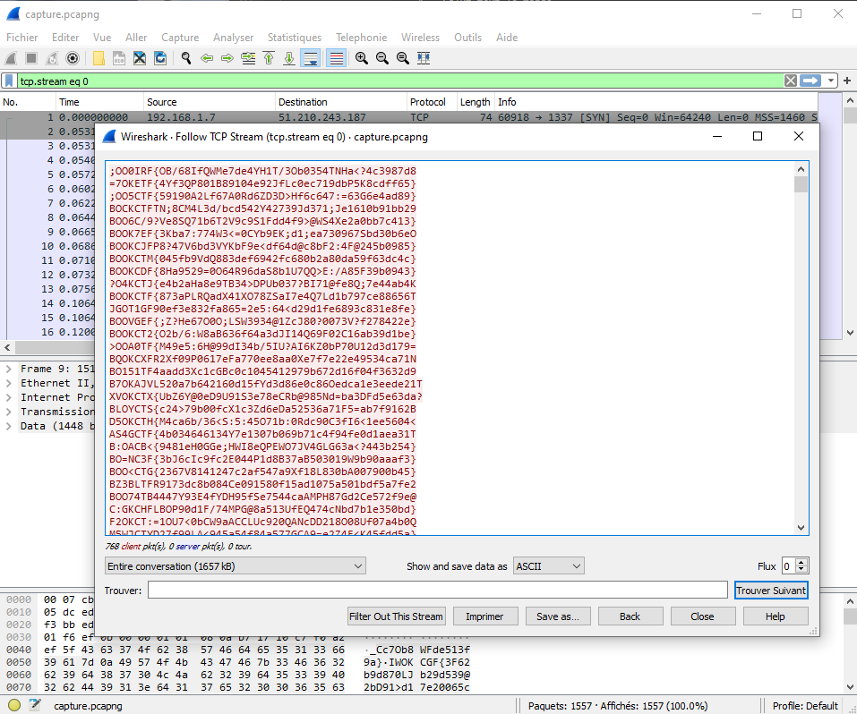

# BookCTF - Without Me 

## Introduction
Salut tout le monde,
"Without Me" est le nom du 3ème CTF de la partie MISC. 
Je vais te montrer comment j'ai resolu ce CTF :)

## Sommaire

|Partie| Lien |Difficulté|
|------|------|----------|
|Preparation| | Easy |
|Exploitation| | Medium |

## Preparations

### Outil
La premiere chose que nous remarquons est, que le fichier est sous la forme pcapng. In fichier de capture reseau qui peut etre ouvert grace a wireshark.

On ouvre le fichier et on tombe sur beaucoup de trames dont trois trames de handshake TCP (SYN - SYN/ACK - ACK) qui nous prouvent qu'une connexion entre deux machines a été effectuée.

La premiere chose a faire est de suivre le flux tcp pour voir ce qui s'y est passé (follow tcp), soit en faisant un click droit sur une trame et en faisant "follow tcp" soit en mettant en place le filtre : tcp.stream eq 0.

Apres avoir decouvert tous ce qu'on echangée les deux machines pendant la connexion, je me rend compte ... que c'est un piege, puisque il y a plusieurs centaines de fois des choses differentes mais ressemblant a des flags. Je sauvegarde le tout dans un fichier texte et je passe a l'etape d'apres.

## Exploitation

### Script
Etant donné que toutes les lignes se ressemblent j'ai ecrit un script en python qui permet de trouver la ligne qui a exactement le format voulu (BOOKCTF{...}).

Je run le script et ... il me sort trois lignes qui sont potentiellement des flags !

Je fais un autre programme qui tire le flag au hasard dans le fichier.

Et c'est le bon flag !

Et voila comment j'ai resolu ce challenge, et peut etre comme d'autre l'ont resolu.

### Merci d'avoir lu ce writeup

